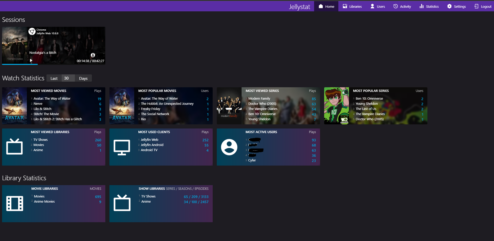
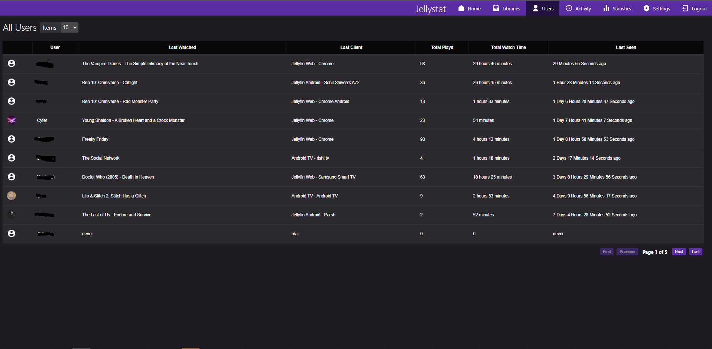
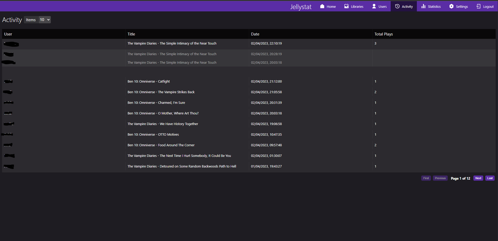
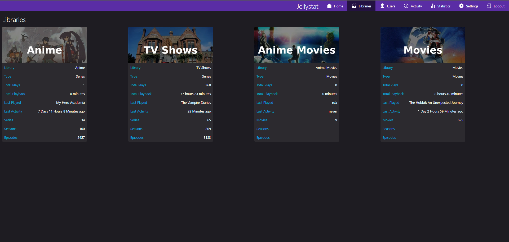

**Jellystat** is a free and open source Statistics App for Jellyfin!

## Current Features

- Session Monitoring anf logging
- Statistics for all Libraries and Users
- Watch History
- User Overview and activity
- Watch statisitcs

## Required Development
- Responsive UI
- Code Optimizations
- Security Testing
- More Validations and Error Handling
- Auto sync library items
- Stats for Library Items (Eg Movies etc)
- More to come

## Getting Started

### Launching Jellystat using Docker

Check out our dockerhub to run Jellystat:
https://hub.docker.com/r/cyfershepard/jellystat

## Screenshots

## Support

- Bug reports and feature requests can be submitted via [GitHub Issues](https://github.com/CyferShepard/Jellystat/issues).

## API Documentation

To-do
