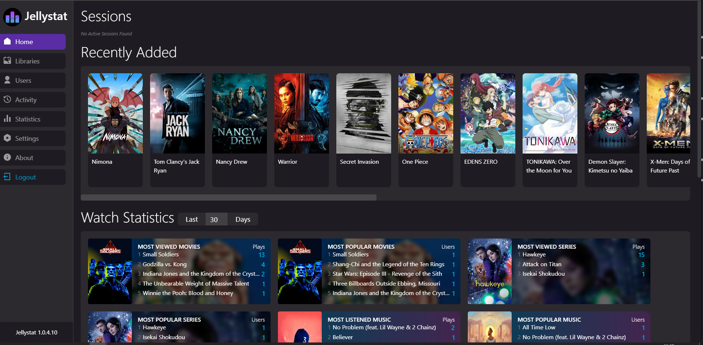
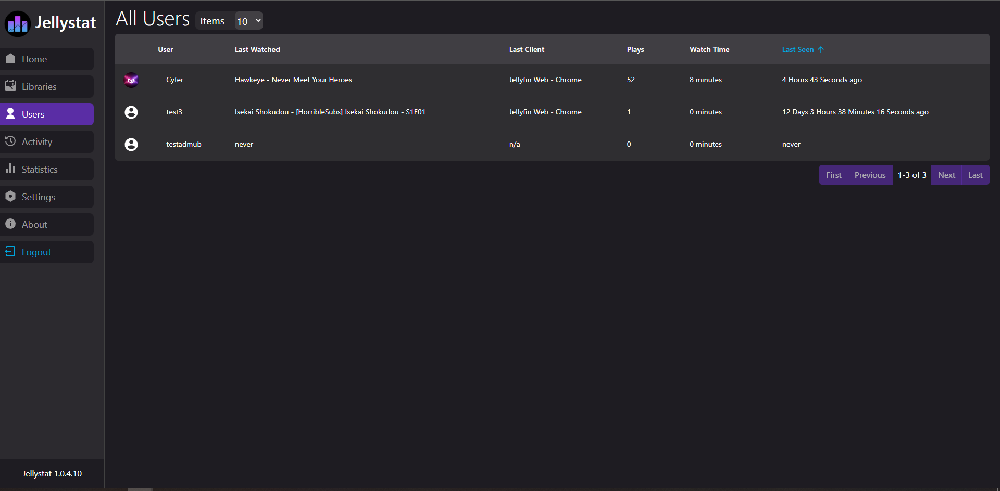
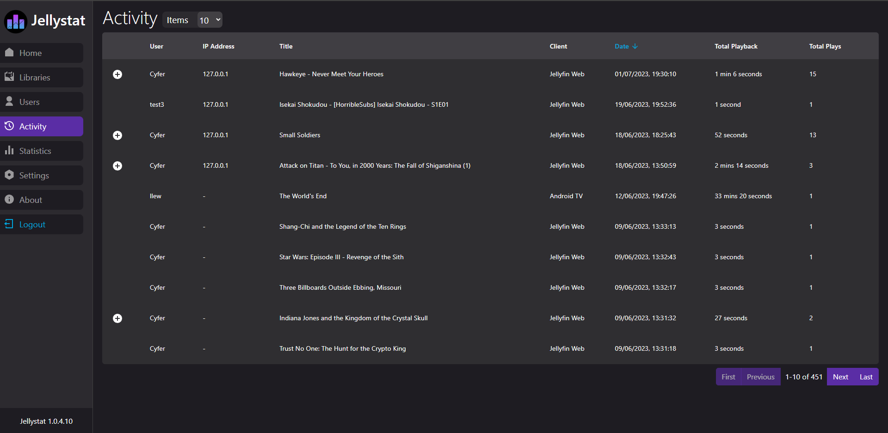
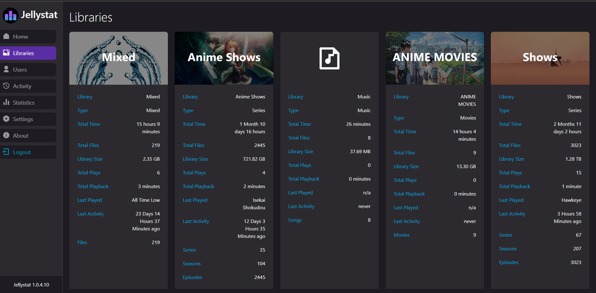

# Jellystat

**Jellystat** is a free and open source statistics web application for Jellyfin.

## Quickstart Docker

Here is an example Docker Compose file.

```yaml
version: "3"
services:
  jellystat:
    container_name: jellystat
    image: ghcr.io/jellystat:latest
    environment:
      POSTGRES_USER: jellystat
      POSTGRES_PASSWORD: mypassword
      POSTGRES_IP: jellystat-db
      POSTGRES_PORT: 5432
      JWT_SECRET: "my-secret-jwt-key"
    depends_on:
      - jellystat-db
    ports:
      - "3000:3000"
    volumes:
      - ./backup-data:/app/backend/backup-data

  jellystat-db:
    container_name: jellystat-db
    image: postgres:15-alpine
    environment:
      POSTGRES_DB: "jfstat"
      POSTGRES_USER: jellystat
      POSTGRES_PASSWORD: mypassword
    volumes:
      - ./postgres-data:/var/lib/postgresql/data

networks:
  default:
```

## Start development

- Fork and clone the project on Github
- Start a PostgreSQL server locally (you can use the example above and expose port `5432`` locally)
- Configure environment variable locally (the one in the Docker Compose example)
- Run `npm init` to install necessary packages
- Run `npm run start-server` to only run the backend nodejs server
- Run `npm run start` to only run the frontend React UI
- Run `npm run start-app` to run both backend and frontend at the same time

## Screenshots







## Original project

This project is a fork from [`CyferShepard/Jellystat`](https://github.com/CyferShepard/Jellystat), with some improvements. Thanks a lot to him for this work released under an MIT license.
