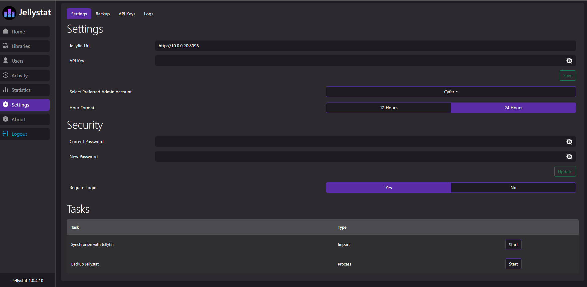

<p align="center">

**Jellystat** is a free and open source Statistics App for Jellyfin! (This project is still in development - expect some weirdness)

## Current Features

- Session Monitoring and logging
- Statistics for all Libraries and Users
- Watch History
- User Overview and activity
- Watch statisitcs
- Backup and restore Data
- Auto sync library items
- Jellyfin Statistics Plugin Integration

## Required Development

- Responsive UI
- Code Optimizations
- Security Testing
- More Validations and Error Handling
- Multi-Server support
- More to come

## Environmental Variables

| Env                                 | Default   | Example                         | Description                                                                                                                              |
| ----------------------------------- | --------- | ------------------------------- | ---------------------------------------------------------------------------------------------------------------------------------------- |
| POSTGRES_USER `REQUIRED`            | `null`    | `postgres`                      | Username that will be used in postgres database                                                                                          |
| POSTGRES_PASSWORD `REQUIRED`        | `null`    | `postgres`                      | Password that will be used in postgres database                                                                                          |
| POSTGRES_IP `REQUIRED`              | `null`    | `jellystat-db` or `192.168.0.5` | Hostname/IP of postgres instance                                                                                                         |
| POSTGRES_PORT `REQUIRED`            | `null`    | `5432`                          | Port Postgres is running on                                                                                                              |
| POSTGRES_SSL_ENABLED                | `null`    | `true`                          | Enable SSL connections to Postgres                                                                                                       |
| POSTGRES_SSL_REJECT_UNAUTHORIZED    | `null`    | `false`                         | Verify Postgres SSL certificates when POSTGRES_SSL_ENABLED=true                                                                          |
| JS_LISTEN_IP                        | `0.0.0.0` | `0.0.0.0` or `::`               | Enable listening on specific IP or `::` for IPv6                                                                                         |
| JWT_SECRET `REQUIRED`               | `null`    | `my-secret-jwt-key`             | JWT Key to be used to encrypt JWT tokens for authentication                                                                              |
| TZ `REQUIRED`                       | `null`    | `Etc/UTC`                       | Server timezone (Can be found at https://en.wikipedia.org/wiki/List_of_tz_database_time_zones#List)                                      |
| JS_BASE_URL                         | `/`       | `/`                             | Base url                                                                                                                                 |
| JS_USER                             | `null`    | `User`                          | Master Override User in case username or password used during setup is forgotten (Both `JS_USER` and `JS_PASSWORD` required to work)     |
| JS_PASSWORD                         | `null`    | `Password`                      | Master Override Password in case username or password used during setup is forgotten (Both `JS_USER` and `JS_PASSWORD` required to work) |
| POSTGRES_DB                         | `jfstat`  | `jfstat`                        | Name of postgres database                                                                                                                |
| REJECT_SELF_SIGNED_CERTIFICATES     | `true`    | `false`                         | Allow or deny self signed SSL certificates                                                                                               |
| JS_GEOLITE_ACCOUNT_ID               | `null`    | `123456`                        | maxmind.com user id to be used for Geolocating IP Addresses (Can be found at https://www.maxmind.com/en/accounts/current/edit)           |
| JS_GEOLITE_LICENSE_KEY              | `null`    | `ASDWdaSdawe2sd186`             | License key you need to generate on maxmind to use their services                                                                        |
| MINIMUM_SECONDS_TO_INCLUDE_PLAYBACK | `1`       | `10`                            | The minimum time (in seconds) to include a playback record, which can be used to exclude short playbacks                                 |
| IS_EMBY_API                         | `false`   | `true`                          | Set to true if using Emby instead of Jellyfin                                                                                            |
| JF_USE_WEBSOCKETS                   | `true`    | `false`                         | Enables using Jellyfins websocket connection for session data (No effect on Emby)                                                        |

## Getting Started with Development

- Clone the project from git
- Set your env variables before starting the server (Variable names as per [Environmental Variables](#environmental-variables) above).
- Run `npm install` to install necessary packages
- Run `npm run build` to build local files ready to run
- Run `npm run start-server` to only run the backend nodejs server
- Run `npm run start-client` to only run the frontend React UI
- Run `npm run start-app` to run both backend and frontend at the same time

When contributing please ensure to log a pull request on the `unstable` branch

### Launching Jellystat using Docker

Check out our dockerhub to run Jellystat:
https://hub.docker.com/r/cyfershepard/jellystat

### Environment variables from files (Docker secrets)

You can set any environment variable from a file by using the prefix `FILE__`

As an example:

```yaml
jellystat:
  environment:
    FILE__MYVAR: /run/secrets/MYSECRETFILE
```

Will set the environment variable `MYVAR` based on the contents of the `/run/secrets/MYSECRETFILE` file. see [docker secrets](https://docs.docker.com/compose/use-secrets/) for more info.

## Screenshots




## Support

- Bug reports and feature requests can be submitted via [GitHub Issues](https://github.com/CyferShepard/Jellystat/issues).
- Join us in our [Discord](https://discord.gg/9SMBj2RyEe)

## API Documentation

Swagger Documentation can be found at `/swagger` endpoint
